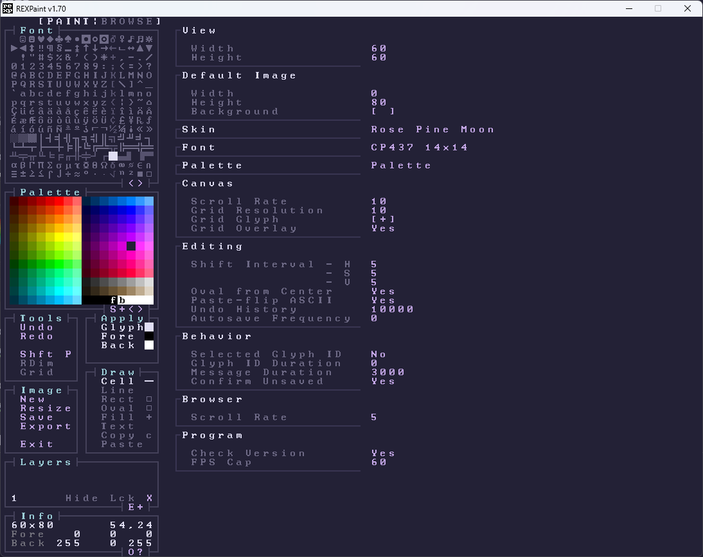
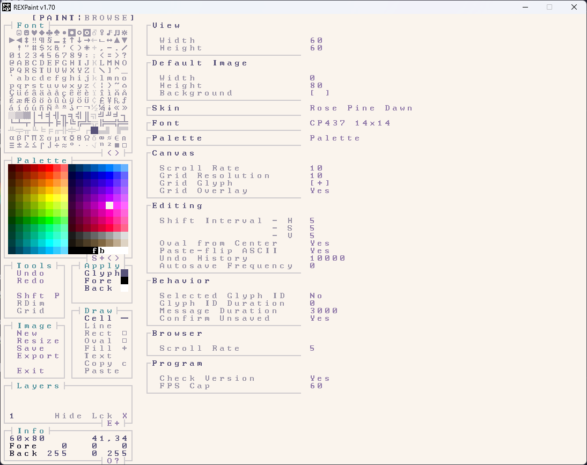

    
    <h2 align="center">Rosé Pine for REXPaint</h2>

All natural pine, faux fur and a bit of soho vibes for the classy minimalist

## Usage

1. Open `data\Appskins.xt` from REXPaint
2. Paste the contents of `rose-pine.xt` on a new line
3. Open REXPaint
4. Open the options menu with F3 and select your desired color scheme from the skins dropdown
5. Alternatively, repeatedly press F4 to cycle through the avaliable skins

## Gallery

### Rosé Pine

### Rosé Pine Moon

### Rosé Pine Dawn

## Thanks to

- [foxface](https://github.com/foxf4ce)
